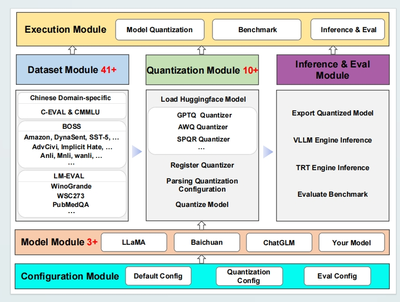
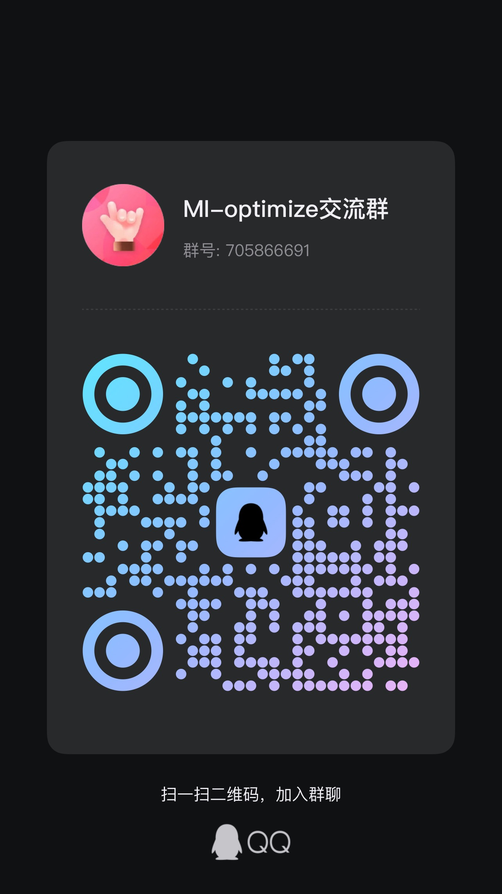

# MI-optimize

MI-optimize (MLinference Optimize) is a project designed to optimize machine learning inference processes. The framework combines multiple modules to provide a cohesive and efficient pipeline for model quantization and evaluation.

## Table of Contents

- [Introduction](#introduction)
- [Framework Overview](#framework-overview)
- [Features](#features)
- [Installation](#installation)
  - [Prerequisites](#prerequisites)
  - [Install from Source](#install-from-source)
  - [Install from PyPi](#install-from-pypi)
- [Usage](#usage)
  - [Quantization](#quantization)
  - [Evaluation](#evaluation)
  - [Inference](#inference)
- [OOD Benchmark Results](#ood-benchmark-results)
- [Contact Us](#contact-us)
- [Cite](#cite)


## News or Update

## Introduction
Although LLMs excel in various NLP tasks, their computational and memory demands may limit their deployment in real-time applications and on resource-constrained devices. MI-optimize addresses this challenge by employing quantization techniques to compress these models, ensuring they maintain performance while remaining adaptable to a wide range of scenarios. 

## Framework Overview
Here's a concise version of the description for the MI-optimize framework:


## Features

### Quantization of Large Language Models (LLMs)
- **Reduce Computational and Memory Requirements**: Optimizes large language models for deployment in resource-limited environments using advanced quantization techniques.

### Support for Various Quantization Algorithms
- **Broad Selection**: Includes a wide range of quantization algorithms, such as RTN, GPTQ, AWQ, SPQR, ZeroQuant, SmoothQuant, QuIP, FP8, and combinations like AWQ+GPTQ and SmoothQuant+GPTQ.

### Evaluation on Out-of-Distribution (OOD) Tasks
- **Robust Performance Evaluation**: Uses established benchmarks like BOSS to ensure models maintain performance on OOD tasks.

### Support for Multiple Datasets
- **Extensive Dataset Compatibility**: Supports a variety of datasets for calibration and testing, including user-provided custom datasets.

### Advanced Quantization Features
- **Flexible Application**: Allows combination of different quantization methods within the same model for enhanced performance and efficiency.
- **Ease of Expansion**: Modular design facilitates easy addition of new quantization algorithms to remain up-to-date with advancements.
- **Custom Tools**: Offers tools for users to quantize and evaluate their own models, ensuring optimal performance tailored to specific needs.

## Installation

### Prerequisites

- **Python**: Python 3.7 or higher must be installed on your system. 

- **Libraries**: Ensure that all necessary libraries are installed. These libraries are listed in the `requirements.txt` file. 

### Install from Source

1. Clone the repository:

    ```bash
    git clone https://github.com/TsingmaoAI/MI-optimize.git
    cd MI-optimize
    ```

2. Create and activate a virtual environment (optional but recommended):

    ```bash
    conda create -n {env_name} python=3.10
    conda activate {env_name}
    ```

3. Install the package in editable mode:

    ```bash
    pip install -e .
    ```

### Install from PyPi

To install the newest MI-optimize from PyPi

```bash
pip install mi_optimize
```
Choose either method to complete the installation.

## Usage

### Quantization 
Below is an example of how to set up the quantization process for a model. For detailed information on all available quantization configuration options, please refer to the [quantization configuration guide](configs/quantization_config.md).
```
# Import necessary libraries
from transformers import AutoModelForCausalLM, LlamaTokenizer
from mi_optimize import quantize
from mi_optimize.export import export_module

# Define paths for the pre-trained model and quantized model
model_path = 'meta-llama/Llama-2-7b-hf'
quant_path = 'llama-2-7b-quant.pth'

# Define quantization configuration
quant_config = {
    "algo": "rtn",
    "kwargs": {'w_dtype': "int4", 'a_type': "float16"},
    "calibrate_data": "wikitext2"  # select from  ['wikitext2', 'c4', 'ptb', 'cmmlu', 'cmmlu_hm', 'cmmlu_st', 'cmmlu_ss', 'NaturalLanguageInference_mnli']
 }

# Load the pre-trained Hugging Face model
model = AutoModelForCausalLM.from_pretrained(model_path, trust_remote_code=True).half()  
tokenizer = LlamaTokenizer.from_pretrained(model_path)

# Quantize the model
model = quantize(model, quant_config=quant_config)

model.cuda()

input_text = "Llama is a large language model"

input_ids = tokenizer.encode(input_text, return_tensors="pt")

output = model.generate(input_ids.cuda(), max_length=100, num_return_sequences=1, do_sample= False)

decoded_output = tokenizer.decode(output[0], skip_special_tokens=True)
print(decoded_output)

# Save the quantized model
model = export_module(model)
torch.save(model, quant_path)
```

### Evaluation 
Below is an example of how to evaluate a quantized model on various datasets. For a full explanation of all input parameters used in the evaluation functions, please refer to the [detailed parameter documentation](benchmark/PARAMETER_DETAILS.md).
```
import torch
from mi_optimize import Benchmark
from transformers import LlamaTokenizer, AutoModelForCausalLM

# model_path = 'meta-llama/Llama-2-7b-hf'
quantize_model_path = 'llama-2-7b-quant.pth'
# Load Benchmark
benchmark = Benchmark()

# Load Model && tokenizer
tokenizer = LlamaTokenizer.from_pretrained(model_path)
model = torch.load(quantize_model_path)
#model = AutoModelForCausalLM.from_pretrained(model_path, trust_remote_code=True).half().cuda()

# Evaluate Perplexity (PPL) on various datasets
test_dataset = ['wikitext2']  
results_ppl = benchmark.eval_ppl(model, tokenizer, test_dataset)
print(results_ppl)

# Evaluate the model on the ceval_benchmark
results_ceval = benchmark.eval_ceval(model, tokenizer, model_type='baichuan', subject='all', num_shot=0)
print(results_ceval)

# Evaluate the model on the mmlu benchmark
results_cmmlu = benchmark.eval_cmmlu(model, tokenizer, model_type='baichuan', subject='all', num_shot=0)
print(results_cmmlu)

# Evaluate the model on the BOSS benchmark
results_boss = benchmark.eval_boss(model, tokenizer, test_dataset='QuestionAnswering_advqa', split='test', ICL_split='test', num_shot=0)
print(results_boss)

# Evaluate using lm-evaluation-harness
eval_tasks = [
    "winogrande",       
    "piqa",             
    "hellaswag",       
]
results_lm_evaluation = benchmark.eval_lmeval(model, tokenizer, eval_tasks, num_shot=5)
print(results_lm_evaluation)
```

### Inference
```
import torch
import time
from transformers import LlamaTokenizer, TextGenerationPipeline
from mi_optimize.export import qnn

# Path to the quantized model
quant_path = 'llama-2-7b-4bit.pth'

# Path to the tokenizer
tokenizer_path = 'meta-llama/Llama-2-7b-hf'

# Load the quantized model
model = torch.load(quant_path)

# Load the tokenizer
tokenizer = LlamaTokenizer.from_pretrained(tokenizer_path, trust_remote_code=True)

# Input prompt
prompt = "You're standing on the surface of the Earth. "

# Tokenize the input prompt
tokens = tokenizer(prompt, return_tensors='pt').input_ids.cuda()

# Choose the backend for inference ('naive', 'vllm', 'tensorrt')
backend = 'naive'   

if backend == 'naive':
    start_time = time.time()
    output = model.generate(tokens, max_tokens=512)
    decoded_output = tokenizer.decode(output[0], skip_special_tokens=True)
    print(decoded_output)

elif backend == 'vllm':
    pass  # This will be added soon
```

### Quantize && Evaluation(Command-line)
To run the quantization and evaluation pipeline, use the provided `quantization.py` script. Below are the command-line arguments and an example command.

### Arguments

- `--model-path` (str): Path to the pre-trained language model (LLM) that you want to quantize.
- `--algo` (str): Quantization algorithm to use. Choices: `rtn`, `gptq`, `awq`, `spqr`, `zeroquant`, `smoothquant`, `quip`.
- `--wbit` (int): Number of bits for weight quantization.
- `--abit` (int): Number of bits for activation quantization.
- `--w-groupsize` (int): Group size for quantization. The group size determines how weights and activations are grouped together during the quantization process. (Options: 32, 64, 128)
- `--benchmark` (str): Specifies the benchmark dataset to use for evaluation.
- `--num-calibrate` (int): Number of samples used for calibration during the quantization process.
- `--num-shot` (int): Number of few-shot examples used for evaluation.
- `--calibrate-name` (str): Path to the calibration dataset used for quantization.
- `--seqlen` (int): Sequence length for the input data.
- `--device` (str): Device to run the quantization (e.g., `cuda:0`).
- `--offload` (flag): Enables offloading to save memory during quantization.
- `--skip-layers` (str): Specifies the layers to exclude from quantization.
- `--block-sequential` (flag): Uses block-sequential quantization.
- `--layer-sequential` (flag): Uses layer-sequential quantization.
- `--half` (flag): Uses half-precision floating point during quantization.
- `--save` (str): Path to save the quantized model after quantization.
### Example Command

```
python examples/llama/quantization.py \
    --model /home/user/models/Llama-2-7b-hf \
    --algo awq \
    --w-bits 4 \
    --w-groupsize 128 \
    --device cuda:0 \
    --num-calibrate 128 \
    --calibrate-name 'c4' \
    --benchmark ppl \
    --num-shot 1 \
    --save /home/user/tmd-optimize/models
```
or
```
bash scripts/run_llama.sh
```
### Quantize && Evaluation (Code)
For quantization and evaluation within your code, refer to the provided script and customize it according to your requirements. You can adjust the parameters and integrate them into your codebase for seamless quantization and evaluation.

```
from transformers import AutoModelForCausalLM, LlamaTokenizer
from mi_optimize import quantize
from mi_optimize import Benchmark

# Define paths for the pre-trained model and quantized model
model_path = 'meta-llama/Llama-2-7b-hf'
quant_path = 'llama-2-7b-quant.pth'

# Define quantization configuration
quant_config = {
    "algo": "rtn",
    "kwargs": {'w_dtype': "int4", 'a_type': "float16"},
    "calibrate_data": "wikitext2"  # select from  ['wikitext2', 'c4', 'ptb', 'cmmlu', 'cmmlu_hm', 'cmmlu_st', 'cmmlu_ss', 'NaturalLanguageInference_mnli']
 }

# Load the pre-trained Hugging Face model
model = AutoModelForCausalLM.from_pretrained(model_path, trust_remote_code=True).half()  
tokenizer = LlamaTokenizer.from_pretrained(model_path)

# Quantize the model
model = quantize(model, quant_config=quant_config)

benchmark = Benchmark()
# Evaluate Perplexity (PPL) on various datasets
test_dataset = ['wikitext2']  
results_ppl = benchmark.eval_ppl(model, tokenizer, test_dataset)
print(results_ppl)
```
## OOD Benchmark Results
Below are some test results obtained from the Out-of-Distribution (OOD) benchmark evaluation:

### Perplexity (PPL) of the LLaMA-2-7B Model
This table illustrates the perplexity (PPL) results of the LLaMA-2-7B model using different quantization configurations on the WikiText-2 (Wiki2), Penn Treebank (PTB), and C4 datasets. It compares the baseline with SmoothQuant alone and in combination with GPTQ for weight quantization.

| Model                 | Bits | WikiText-2 | PTB       | C4        |
|-----------------------|------|------------|-----------|-----------|
| Baseline              | 16   | 5.47       | 37.92     | 7.22      |
| SmoothQuant           | 8    | 19.70      | 3026.75   | 11.25     |
| SmoothQuant + GPTQ    | 8    | 21.18      | 3110.05   | 11.27     |
| SmoothQuant           | 4    | 34.87      | 5133.82   | 20.82     |
| SmoothQuant + GPTQ    | 4    | 22.95      | 1359.59   | 13.39     |
| SmoothQuant           | 3    | 24041.06   | 42625.86  | 29585.39  |
| SmoothQuant + GPTQ    | 3    | 290.77     | -         | 231.02    |


### Cross-Dataset Distribution Shift in Chinese Domain-Specific Tasks

This table summarizes the performance evaluation across various datasets, highlighting the model's generalization capabilities in both 0-shot and 5-shot settings. Colored backgrounds indicate In-Distribution (I.I.D) results, while non-colored backgrounds signify Out-of-Distribution (OOD) results. Bold figures represent the best performance on the same test dataset.

#### Explanation of Abbreviations:
- **CE-HM, CM-HM**: Calibration and Generalization scenarios in Humanities
- **CE-SS, CM-SS**: Calibration and Generalization scenarios in Social Sciences
- **CE-ST, CM-ST**: Calibration and Generalization scenarios in STEM fields

| Method  | Test | W/A Calib. | 0-shot | 5-shot | Test | W/A Calib. | 0-shot | 5-shot |
|---------|------|------------|--------|--------|------|------------|--------|--------|
| **GPTQ** | CE-HM | CM-HM | 39.4 | 53.2 | CE-HM | CM-HM | 37.9 | 52.1 |
|         | CE-SS | CM-SS | 36.9 | 58.8 | CE-SS | CM-SS | 35.4 | 57.5 |
|         | CE-ST | CM-ST | 30.4 | 41.8 | CE-ST | CM-ST | 26.0 | 39.2 |
| **SpQR** | CE-HM | CM-HM | 38.5 | 53.8 | CE-HM | CM-HM | 36.3 | 52.5 |
|         | CE-SS | CM-SS | 38.2 | 60.0 | CE-SS | CM-SS | 38.9 | 57.7 |
|         | CE-ST | CM-ST | 32.2 | 41.5 | CE-ST | CM-ST | 30.3 | 41.1 |
| **AWQ**  | CE-HM | CM-HM | 36.5 | 47.7 | CE-HM | CM-HM | 35.6 | 49.0 |
|         | CE-SS | CM-SS | 32.2 | 57.5 | CE-SS | CM-SS | 34.9 | 56.7 |
|         | CE-ST | CM-ST | 26.6 | 39.1 | CE-ST | CM-ST | 29.4 | 38.6 |
| **SQ**   | CE-HM | CM-HM | 27.2 | 24.7 | CE-HM | CM-HM | 27.2 | 24.5 |
|         | CE-SS | CM-SS | 27.4 | 24.4 | CE-SS | CM-SS | 26.7 | 24.5 |
|         | CE-ST | CM-ST | 32.2 | 25.5 | CE-ST | CM-ST | 26.2 | 23.9 |

Note: W/A Calib. represents the Weight and Activation calibration configuration used for each test. Each row details the results using different datasets as calibration sets on the same test dataset.

## Contact Us
| Contact Us                |                      |
|---------------------------|----------------------|
| **QQ Group**  |**WeChat**|
|  |  |


## Cite
If you found this work useful, please consider citing:
```
@inproceedings{doe2021evaluating,
  title={Evaluating the Generalization Ability of Quantized LLMs: Benchmark, Analysis, and Toolbox},
  author={Fang Wu and Shenhao Peng and Chaoyu Guan and Hang Yao and Yijun Liu and Yuan Meng and Chen Tang and Xinzhu Ma and Zhi Wang and Wenwu Zhu},
  year={2024},
  url={}
}
```